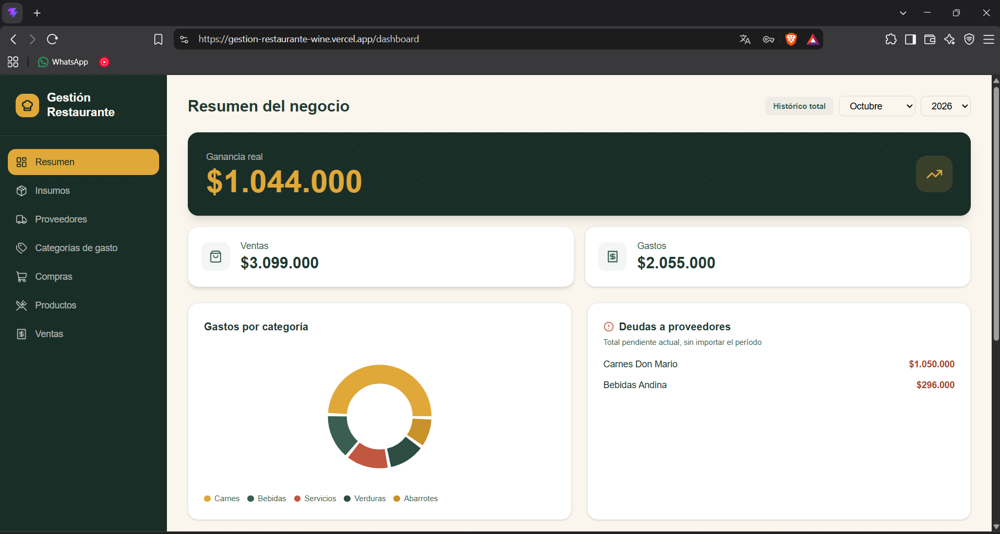
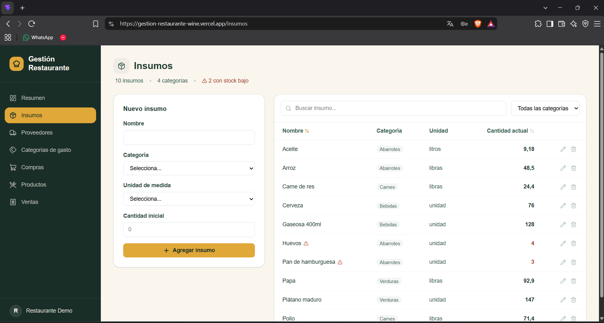
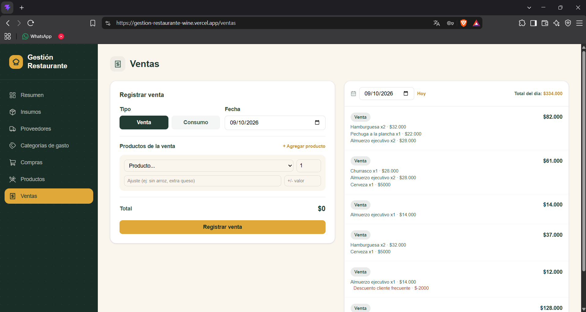
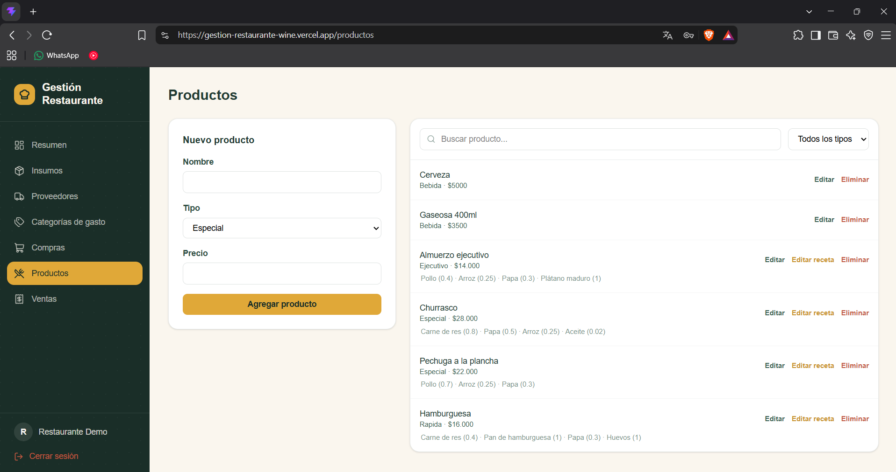

# Gestión Restaurante

Gestión Restaurante

Un restaurante no se quiebra por falta de clientes, sino por no saber en qué se le va la plata.

Este proyecto nació en una cocina de verdad: la del restaurante de mi mamá. Ella llevaba el inventario, las compras y las cuentas con cuaderno y memoria, y yo quise darle algo mejor: un sistema que le diga cuánto vendió, cuánto gastó, qué le debe a cada proveedor y qué se le está acabando, sin hacer cuentas a mano.

Lo especial es que el inventario se mueve solo. Cada plato tiene su receta, y cuando se vende, el sistema descuenta los ingredientes exactos que usó.

Es mi primer proyecto full stack pensado para un negocio real, y lo construí de punta a punta: base de datos, API, interfaz, seguridad y despliegue.

**Demo en línea:** [https://gestion-restaurante-wine.vercel.app](https://gestion-restaurante-wine.vercel.app)

| | |
|---|---|
| Correo | `demo2@restaurante-demo.com` |
| Clave | `ES_DEMOES` |

La cuenta demo tiene datos inventados. Si prefieres empezar de cero, puedes registrarte con cualquier correo y tendrás una cuenta vacía.



## Qué hace

- **Dashboard:** ventas, compras, ganancia, gastos por categoría y deudas con proveedores.
- **Insumos:** inventario por categoría, búsqueda, orden por columnas y alertas de stock bajo. Se puede corregir la cantidad cuando el inventario físico no cuadra.
- **Compras:** de insumos (suben el inventario) o gastos generales con su categoría, marcadas como pagadas o pendientes.
- **Productos y recetas:** platos con los insumos y cantidades que usan, y bebidas ligadas directamente a un insumo.
- **Ventas:** con adiciones y descuentos por línea, y consumo interno, que no cuenta como ingreso. Al registrar una venta se descuenta el inventario según la receta.
- **Proveedores y categorías de gasto:** con validación de duplicados.





## Tecnologías

- **Frontend:** React, Vite, Tailwind CSS, Framer Motion, Lucide.
- **Backend:** Node.js, Express.
- **Base de datos:** PostgreSQL.
- **Seguridad:** JWT, bcrypt, límite de intentos en el login.
- **Despliegue:** Vercel (frontend) y Railway (backend y base de datos).

## Decisiones técnicas

- **Aislamiento entre cuentas.** Cada consulta filtra por el usuario del token, y además se valida que los insumos, proveedores y categorías que llegan en una petición pertenezcan a quien la hace. Lo probé con dos cuentas intentando modificar datos de la otra con el token equivocado, y encontré y corregí varios huecos en recetas, compras y ventas.
- **Transacciones.** Registrar una compra o una venta toca varias tablas y el inventario. Todo se hace dentro de una transacción, y si algo falla no queda nada a medias.
- **Fechas sin desfase.** Las fechas se manejan como texto `YYYY-MM-DD`. Antes, a las 10 u 11 de la noche la venta se registraba con el día siguiente por la conversión a UTC.
- **Historial protegido.** No se puede borrar un insumo con compras o recetas asociadas, para no dejar reportes sin sentido.
- **Registro y login.** Correo normalizado, contraseña de 8 a 72 caracteres y máximo 20 intentos por IP cada 15 minutos.



## Cómo correrlo en tu computador

Necesitas Node.js 18 o superior y PostgreSQL.

```bash
git clone https://github.com/ING-AHC/Gestion-Restaurante.git
cd Gestion-Restaurante
```

**Base de datos**

```bash
psql -U postgres -c "CREATE DATABASE gestion_restaurante"
psql -U postgres -d gestion_restaurante -f backend/db/schema.sql
```

**Backend**

```bash
cd backend
npm install
```

Crea `backend/.env`:

```
PORT=4000
DB_USER=postgres
DB_PASSWORD=tu_clave
DB_HOST=127.0.0.1
DB_PORT=5432
DB_NAME=gestion_restaurante
JWT_SECRET=una_cadena_larga_y_aleatoria
```

```bash
npm run dev
```

**Frontend**

```bash
cd frontend
npm install
```

Crea `frontend/.env`:

```
VITE_API_URL=http://localhost:4000/api
```

```bash
npm run dev
```

Abre `http://localhost:5173`.

**Datos de ejemplo (opcional):** con el backend corriendo, `scripts/seedDemo.js` carga una cuenta con datos inventados.

```bash
API_URL=http://localhost:4000/api DEMO_PASSWORD=una_clave node scripts/seedDemo.js
```

En PowerShell, define las variables con `$env:API_URL = "..."` y `$env:DEMO_PASSWORD = "..."` antes de correr `node scripts/seedDemo.js`.

## Próximos pasos

- Pedidos desde el celular del mesero, con pantalla de cocina en tiempo real.
- Usuarios de personal con roles.
- Comprobante imprimible.

## Autor

[Alejandro Hurtado Collazos] · [ALEJANDRO HURTADO COLLAZOS] · [Al.hurtado20@gmail.com]
